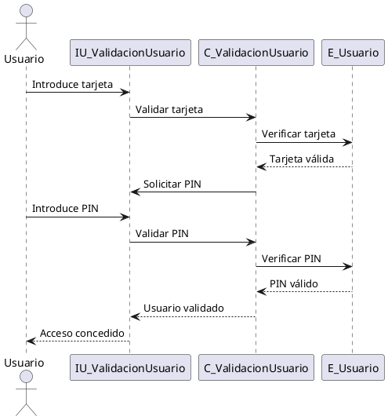
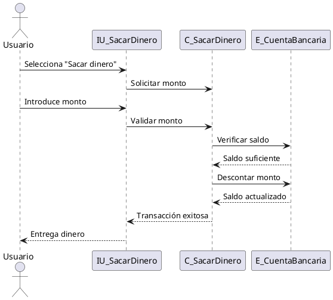
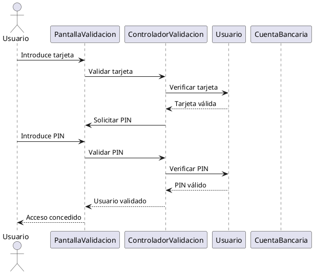
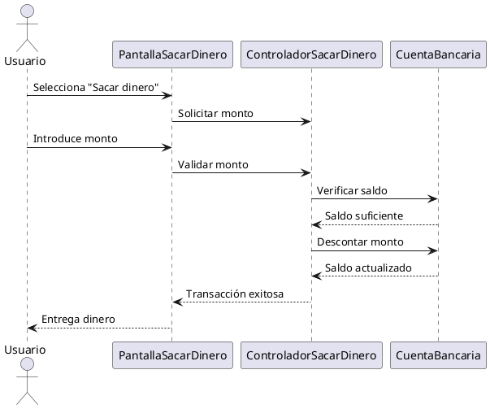

# Diagrama-de-secuencias

### **Trabajo a Realizar**

---

#### **a) Diagramas de Secuencia**

##### **1. Clases Estereotipadas (Análisis)**
A partir del diagrama de estados que hicimos antes, identificamos las clases que necesitamos para los casos de uso **CU: Validación Usuario** y **CU: Sacar Dinero**. Estas clases se dividen en tres tipos:

- **Interfaces**:
  - `IU_ValidacionUsuario`: Es la pantalla donde el usuario mete la tarjeta y el PIN.
  - `IU_SacarDinero`: Es la pantalla donde el usuario elige cuánto dinero quiere sacar.

- **Control**:
  - `C_ValidacionUsuario`: Es el "jefe" que controla si la tarjeta y el PIN son correctos.
  - `C_SacarDinero`: Es el "jefe" que controla si se puede sacar el dinero.

- **Entidad**:
  - `E_Usuario`: Aquí están los datos del usuario, como su tarjeta y PIN.
  - `E_CuentaBancaria`: Aquí está la información de la cuenta, como el saldo.

---

##### **2. Diagrama de Secuencia Básico (Estereotipado)**

###### **Código en PlantUML para CU: Validación Usuario**

###### **Código en PlantUML para CU: Sacar Dinero**

---

##### **3. Clases de Diseño**
Ahora, a partir de las clases anteriores, creamos las clases de diseño, que son como las versiones "reales" que se usarían en el programa:

- **Interfaces**:
  - `PantallaValidacion`: Es la pantalla donde el usuario mete la tarjeta y el PIN.
  - `PantallaSacarDinero`: Es la pantalla donde el usuario elige cuánto dinero quiere sacar.

- **Control**:
  - `ControladorValidacion`: Es el que verifica si la tarjeta y el PIN son correctos.
  - `ControladorSacarDinero`: Es el que verifica si se puede sacar el dinero.

- **Entidad**:
  - `Usuario`: Aquí están los datos del usuario, como su tarjeta y PIN.
  - `CuentaBancaria`: Aquí está la información de la cuenta, como el saldo.

---

##### **4. Diagrama de Secuencia Final**

###### **Código en PlantUML para CU: Validación Usuario (Final)**

###### **Código en PlantUML para CU: Sacar Dinero (Final)**

---

#### **b) Interpretación del Diagrama Final de CU: Validación Usuario**

El diagrama de secuencia final para el caso de uso **Validación Usuario** muestra cómo el usuario se valida en el cajero. Aquí está explicado paso a paso:

1. **El usuario mete la tarjeta**:
   - El usuario introduce su tarjeta en la `PantallaValidacion`.

2. **Se valida la tarjeta**:
   - La `PantallaValidacion` le dice al `ControladorValidacion` que valide la tarjeta.
   - El `ControladorValidacion` le pregunta a la clase `Usuario` si la tarjeta es válida.

3. **Tarjeta válida**:
   - Si la tarjeta es válida, el `ControladorValidacion` le pide a la `PantallaValidacion` que pida el PIN.

4. **El usuario mete el PIN**:
   - El usuario introduce su PIN en la `PantallaValidacion`.

5. **Se valida el PIN**:
   - La `PantallaValidacion` le dice al `ControladorValidacion` que valide el PIN.
   - El `ControladorValidacion` le pregunta a la clase `Usuario` si el PIN es correcto.

6. **PIN válido**:
   - Si el PIN es correcto, el `ControladorValidacion` le dice a la `PantallaValidacion` que el usuario está validado.

7. **Acceso concedido**:
   - La `PantallaValidacion` le dice al usuario que puede usar el cajero.

---

#### **c) ¿De qué manera te ayuda un diagrama de secuencias durante el proceso de desarrollo del software?**

Un diagrama de secuencias es super útil cuando estás haciendo un programa porque:

1. **Te ayuda a entender cómo funciona todo**:
   - Te muestra paso a paso cómo los objetos (como las pantallas y los controladores) interactúan entre sí.

2. **Te ayuda a encontrar errores**:
   - Si algo no está funcionando bien, puedes mirar el diagrama y ver dónde está el problema.

3. **Es fácil de explicar**:
   - Si tienes que explicarle a alguien cómo funciona el programa, el diagrama es una forma clara y sencilla de hacerlo.

4. **Te guía para escribir el código**:
   - El diagrama te dice qué tiene que hacer cada parte del programa, así que es más fácil escribir el código.

5. **Sirve como documentación**:
   - Si en el futuro alguien tiene que arreglar o mejorar el programa, el diagrama le ayuda a entender cómo está hecho.

